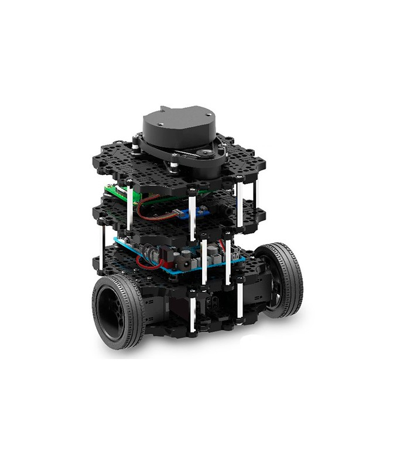

# ROS - Get Started

## Installation Ubuntu 

* Install Ubuntu on VMWare player (Free) https://ubuntu.tutorials24x7.com/blog/how-to-install-ubuntu-on-windows-using-vmware-workstation-player 
* ISO file of Ubuntu 18.04: https://releases.ubuntu.com/18.04.5/

## Linux

* Course 'Linux for Robotics' (Free) [ConstructSim](https://www.theconstructsim.com). You have to make a own account

* Learning Linux (Free for VIVES student)
https://www.linkedin.com/learning/introduction-to-linux/learning-linux 
* Learning Ubuntu Desktop (Free for VIVES student)
https://www.linkedin.com/learning/learning-ubuntu-desktop/ 
* Learning Linux command line (Free for VIVES student)
   https://www.lynda.com/Linux-tutorials/Learning-Linux-command-line/753913/775904-4.html
   

## Python

* Course 'Python for Robotics' (Free) [ConstructSim](https://www.theconstructsim.com). You have to make a own account

* Get started python programming (SYNTAX)
 https://www.programiz.com/python-programming
* Example programs python
 https://www.programiz.com/python-programming/examples
* IDE 
 https://www.jetbrains.com/ or VScode

## ROS 

### Documentation ROS
* [ROS for Absolute beginners](doc/ROS/2018_Book_RobotOperatingSystemROSForAbso.pdf)
* [Robot Programming](doc/ROS/ROS_Robot_Programming_EN.pdf)

### Turtlebot

* Manual Turtlebot 3: https://emanual.robotis.com/docs/en/platform/turtlebot3/simulation/
* Ebook ROS and Turtlebot: https://www.robotis.com/service/download.php?no=719

